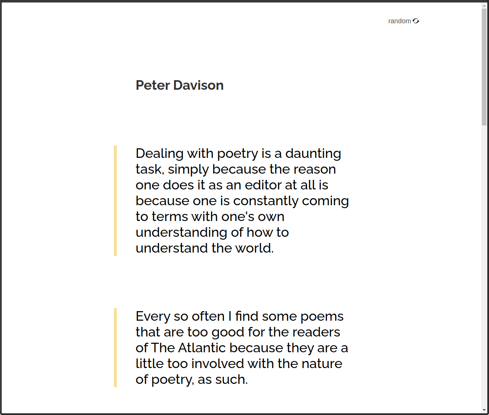

<h1 align="center">QuoteGen</h1>
<div align="center">
   Solution for a challenge from  <a href="https://devchallenges.io/challenges/8Y3J4ucAMQpSnYTwwWW8" target="_blank">devchallenges.io</a>
</div>
<div align="center">
  <h3>
    <a href="https://quote-genn.netlify.app/">
      Demo
    </a>
    <span> | </span>
    <a href="https://devchallenges.io/challenges/8Y3J4ucAMQpSnYTwwWW8">
      Challenge
    </a>
  </h3>
</div>
  
<!-- TABLE OF CONTENTS -->  
  
## Table of Contents
  
- [Overview](#overview)
  - [Built With](#built-with)
- [Features](#features)
- [How to use](#how-to-use)
- [Contact](#contact)
- [Acknowledgements](#acknowledgements)
  

<!-- OVERVIEW -->  
  
## Overview
  
  
  
  
You can see a live demo of my app [**here**](https://quote-genn.netlify.app/). Before I started working on this project, my knowledge of Angular was close to zero. I learned things like:  
  
- CSS! Grid and Flex,
- Components! Breaking down Angular applications into components,
- Routing! Abandoning `if`-s in favor of routing,
- Types! Mapping api data to objects and creating custom types,
- Services! I wrote my first service,
- Deploy! I published my first Angular app
  

### Built With  
  
- [Angular](https://angular.io/)  
  

## Features  
  
This application/site was created as a submission to a [DevChallenges](https://devchallenges.io/challenges) challenge. The [challenge](https://devchallenges.io/challenges/8Y3J4ucAMQpSnYTwwWW8) was to build an application to complete the given user stories:  
  
- I can see a random quote
- I generate a new random quote
- When I select quote author, I can see a list of quotes from them
- I can see quote genre under the author
  

## How To Use  
  
To clone and run this application, you'll need [Git](https://git-scm.com), [Node.js](https://nodejs.org/en/download/) (which comes with [npm](http://npmjs.com)) and [Angular](https://angular.io/) installed on your computer. From your command line:  
  
```bash
# Clone this repository
$ git clone git@github.com:kMatejak/devch-random-quote-gen.git quote-gen

# Go to the project directory
$ cd quote-gen/quote-generator

# Install dependencies
$ npm install

# Run the app
$ ng serve
```  
  

## Acknowledgements  
  
- [Steps to replicate a design with only HTML and CSS](https://devchallenges-blogs.web.app/how-to-replicate-design/)
- [Mozilla's Basic Concepts of Grid Layout](https://developer.mozilla.org/en-US/docs/Web/CSS/CSS_Grid_Layout/Basic_Concepts_of_Grid_Layout)
- [Grid vs. Flex (video, 11m 42s)](https://www.youtube.com/watch?v=RSIclWvNTdQ)
- [Intro to the CSS Grid (interactive course, ~1h)](https://scrimba.com/learn/R8PTE/intro-to-the-css-grid-course-cg9PpTb)
- [CSS values and units](https://developer.mozilla.org/en-US/docs/Learn/CSS/Building_blocks/Values_and_units)
- [A Hassle-Free Way to Self-Host Google Fonts](https://google-webfonts-helper.herokuapp.com/fonts)
- [Angular coding style guide](https://angular.io/guide/styleguide)
- [Angular components](https://angular.io/guide/component-overview)
- [Angular in-app navigation: routing to views](https://angular.io/guide/router)
- [Requesting data from a server](https://angular.io/guide/http#requesting-data-from-a-server)
  

## Contact  
  
- GitHub [@kMatejak](https://github.com/kMatejak)
- Website [matejak.com](http://matejak.com)
  